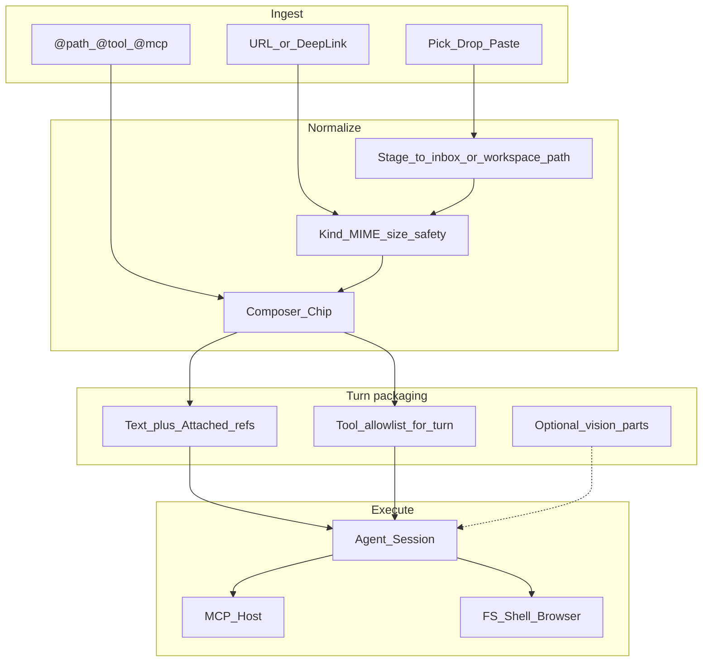

# ADE Composer — Media, Connections, Tools & Integrations Gameplan

**Date:** 2026-07-23  
**Status:** Living plan (path-first slice shipped; this doc is the full capture surface)  
**Related:** [ADE-Master-Gameplan.md](./ADE-Master-Gameplan.md), path-first chips in Desktop composer

---

## 0. Why this exists

Advanced composers (Cursor, Claude Desktop, ChatGPT apps, IDE agents) capture more than text:

1. **Media** — files, images, PDFs, audio, folders, clipboard  
2. **Connections** — URLs, repos, tickets, docs, deep links  
3. **Tools** — what the model can *do* this turn (FS, shell, MCP, browser…)  
4. **Integrations** — durable connectors (GitHub, Linear, Slack, browser profile…)

ADE already has harness DNA for (3) and pieces of (4). Media/connections were thin: text box only, then a **path-first** attach slice. This gameplan maps the full surface so we don’t ship one-off pickers forever.

**Principle (ADE DNA):** Prefer **paths + tools** over stuffing bytes into the model. Vision/OCR are explicit later phases when a provider lane supports them.

---

## 1. Current state (honest)

| Surface | Today | Gap |
|--------|--------|-----|
| Attach pick / drop / paste | Path-first chips → `.ade/inbox/` + `Attached:` block | Button failed without Tauri dialog ACL; fixed with `capabilities/default.json` + HTML fallback |
| Images in chat render | http(s) markdown imgs + local preview via `convertFileSrc` | No vision to model |
| PDF | Path chip + OS open | No extract / page preview |
| Folders | Refused / skipped | Need “attach as path” (no recurse dump) |
| URLs / tickets | Blue links; file-like → chips | No unfurl / fetch-as-context |
| Clipboard | File paste only | No rich HTML → markdown; no “paste path from explorer” |
| Tools (turn) | Autonomy + MCP + shell + leases | No composer “@tool” picker |
| Integrations | Keys, MCP servers, browser, Zed, terminal | No unified Connections hub |

---

## 2. Target architecture

**Chip kinds (composer + feed):**

| Kind | Examples | Turn packaging |
|------|----------|----------------|
| `file` | `.rs`, `.md`, `.json` | Path ref |
| `image` | png/jpg/webp/gif | Path ref; later: vision part |
| `pdf` | `.pdf` | Path ref; later: text extract summary |
| `archive` | zip/tar | Path only (no auto-unpack) |
| `folder` | directory | Path string + “list only” hint |
| `url` | https… | URL + optional fetch-to-`.ade/inbox/fetch-*.md` |
| `ticket` | `GH#123`, Linear | Deep link + id in Attached |
| `audio` / `video` | mp3/wav/m4a/… | Path + Debug **Transcribe** → `.ade/inbox/*.transcript.md` |
| `tool` | MCP tool / shell | Not a file — scopes turn tools |
| `integration` | connected GitHub | Auth’d connector, not per-message bytes |

---

## 3. Media capture matrix (composer parity)

### Phase M0 — Shipped / fixing now
- [x] Pick / drop / paste files  
- [x] Type icons + removable chips  
- [x] Workspace keep vs `.ade/inbox/` copy  
- [x] Size/count caps + secret/exe refuse  
- [x] `Attached:` path block for agent  
- [x] File-like markdown link chips  
- [x] Tauri dialog ACL + HTML file-input fallback  
- [x] Retry CTAs keep last prompt after turn archive  
- [x] Provider 5xx classification broadened (OpenCode Internal Server Error)  
- [x] Image attach hints: do not `read_file` binary as text  

### Phase M1 — Composer completeness (next)
- [x] **Folder attach** as single path chip (no recursive paste) — Alt+click paperclip or paste path  
- [x] **Multi-select** already; add clear-all  
- [x] **Drag onto Home feed** (not only composer)  
- [x] **Screenshot paste** reliability (Windows clipboard image → inbox `.png`) — via paste files + stage_bytes  
- [x] **Path paste**: if clipboard text is an existing path, offer “Attach path” chip  
- [x] **Open** always uses absolute; chip label stays basename  
- [x] Persist chips metadata in `chat_save` JSON (not only parsed `Attached:` text)  
- [x] URL / GitHub ticket chips + optional Fetch → `.ade/inbox/fetch-*.md`  
- [x] Composer `@` mention palette (workspace paths + connected MCP tools)

### Phase M2 — Rich media understanding
- [x] PDF: first-N-pages text extract → `.ade/inbox/*.extract.md` + path to both  
- [x] Image: optional thumbnail strip in user bubble  
- [x] Office: `.docx`/`.xlsx` via extract-to-markdown (opt-in) — `chat_extract_office` · Extract chip · g77–g78  
- [x] Audio: whisper-class **local or API** transcribe → text attach (Debug/Advanced) — `chat_transcribe_audio` · Transcribe chip · `ADE_WHISPER_CMD` or Groq/OpenAI · g79–g80

### Phase M3 — Multimodal providers
- [x] Provider message parts: `text` + `image_url` / base64 when model supports vision  
- [x] Honest spend: dedicated image token reservation (base64 already inflate estimate)  
- [x] Gate: refuse image turns on text-only models with CTA “switch model” (Desktop + Rust)  
- [x] Model profile `vision` flag (+ `tags: ["vision"|"no-vision"]`) overrides heuristic

---

## 4. Connections (URLs, deep links, graph)

| Input | Capture | Normalize | Agent gets |
|-------|---------|-----------|------------|
| `https://…` paste | URL chip | Optional `fetch` → inbox md | Path or URL |
| GitHub PR/issue URL | Ticket chip | Parse owner/repo/# | URL + ids |
| `file://` / Explorer path | File chip | Stage path | Workspace path |
| Repo root drop | Folder chip | Path | Path |
| ADE Atlas / Plan node | `@plan:…` | Internal ref | PLAN path |
| Slack/Linear deep link | Integration chip | Needs auth | URL until connector live |

**Unfurl policy:** never auto-fetch secrets hosts; robots/rate-limit; show “Fetched · N chars” chip detail.

---

## 5. Tools (per-turn) vs Integrations (durable)

### 5.1 Tools — what this turn may call

Already in harness:

- Autonomy: Suggest / Apply / Auto  
- Shell scope: Workspace / Home  
- MCP host + tool call  
- Leases, owned paths, contract gates  
- Browser / Terminal / Editor (Desktop surfaces)

**Composer gaps:**

| Need | Proposal |
|------|----------|
| See allowed tools | Composer “Tools” disclosure: MCP servers connected, shell on/off, browser |
| Pin a tool | `@mcp:server/tool` chip → raise priority / allowlist for turn |
| Disable dangerous | Toggle deny `shell` / `migrate` for this turn (mirrors risk tiers) |
| Verify lane | Existing Verifier slot — keep Debug/Advanced |

### 5.2 Integrations — standing connections

| Integration | Status | Composer role |
|-------------|--------|----------------|
| Provider keys (Zen / FreeLLM / …) | Shipped | Model chip |
| MCP servers | Shipped (Debug-heavy) | `@mcp` + status light |
| Local API / Browser API token | Shipped | Browser view |
| Git worktrees / Isolate | Shipped | Apply strip |
| Zed / system terminal | Shipped | Debug |
| GitHub | Not first-class | PR/issue unfurl + optional Octokit MCP |
| Linear / Jira / Slack | Not first-class | Via MCP recipes |
| Browser profile / cookies | Partial (in-app browser) | “Use Browser” chip |
| Cloud drive (GDrive etc.) | Out | Path sync only if user mounts |

**Product shape:** a **Connections** page (Setup group) listing connectors with status lights — same progressive-ui pattern as Keys/Environment — not a pile of composer buttons.

---

## 6. Safety & spend (non-negotiable)

- Refuse `.env`, keys, exe, oversized blobs (already)  
- Inbox under `.ade/` + SensitivePathPolicy  
- No silent truncation — note + refuse  
- Fetch/unfurl behind explicit chip confirm when domain unknown  
- Vision/multimodal only when rates + caps honest  
- Tools: Act tools still need contract / leases — attachments never bypass Apply DNA  

---

## 7. Implementation roadmap (ordered)

### Sprint A — Make attach trustworthy (now)
1. Dialog ACL capabilities ✅  
2. Error note + HTML fallback ✅  
3. Rebuild Desktop; verify pick/drop/paste on Windows  
4. Smoke: Workspaces “Open folder” dialog still works  

### Sprint B — Composer parity
1. Folder-as-path chip  
2. Path-from-clipboard text  
3. chat_save attachment metadata ✅  
4. `@` mention palette: files in workspace (ripgrep/path) + MCP tools ✅  
5. Drag onto Home feed ✅  
6. URL / ticket chips + optional fetch-to-inbox ✅  

### Sprint C — Connections hub
1. Setup → **Integrations** nav (MCP + GitHub / GitLab / Stripe / Azure + recipes) ✅  
2. URL chip + optional fetch-to-inbox ✅  
3. Ticket URL parse (GitHub first) ✅

### Sprint D — Extracts & vision
1. PDF text extract command ✅ (`chat_extract_pdf` · Extract chip)  
2. Model profile `vision` flag + multimodal message parts ✅  
3. Gold probes: refuse vision on text-only; spend honesty with image reserve ✅ (g74–g76)  

### Sprint E — Integration recipes
1. Document MCP recipes for GitHub/Linear ✅ (`docs/guides/mcp-recipes.md`)  
2. One-click “Add MCP from recipe” in Connections ✅ (Integrations strip + row Add)  
3. Dogfood Continuity with attached PDF + MCP search ✅ (`scripts/dogfood-continuity-pdf-mcp.ps1`)  

---

## 8. Acceptance checklist (definition of done for “advanced composer”)

- [x] Pick, drop, paste image, paste path, attach folder — all produce chips with icons  
- [x] Failures always show a one-line note (never silent)  
- [x] Agent turn always receives resolvable workspace/inbox paths  
- [x] User can open chip in OS viewer  
- [x] Tools for the turn are visible (at least MCP count + shell scope)  
- [x] Connections page lists MCP + keys status without Debug hunting  
- [x] No vision bytes on free text-only models without an honest CTA  

---

## 9. Explicit non-goals (near term)

- In-app PDF reader / Figma embed  
- Auto-unpack zip into context  
- Drag entire `node_modules`  
- Silent cloud sync of inbox  
- Replacing MCP with proprietary plugin marketplace  

---

## 10. Doc ownership

Update this file when a sprint lands. Cross-link Master Gameplan **Execute (FS / shell / MCP)** when Connections hub ships.
